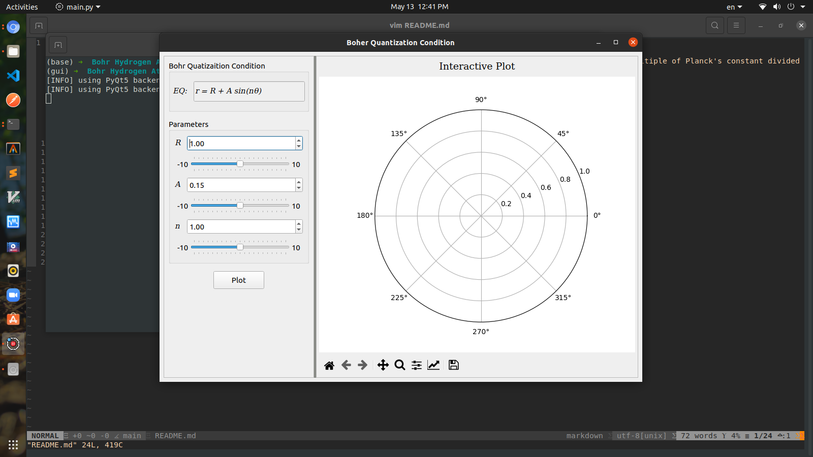

# Bohr Quantization Condition

Bohr's quantization condition: The angular momentum of an electron in an orbit around the hydrogen atom has to be an integral multiple of Planck's constant divided by twice π.

```math
r = R + A.sin(nθ)
```

### requirments
 - python3 >= 3.7.5
 - pyqt5 or pyside2
 - numpy
 - matpoltlib >= 3.3

### install
```sh
$ pip install -r requirments.txt
```

### run
```
$ python3 main.py
```

### Screenshots



